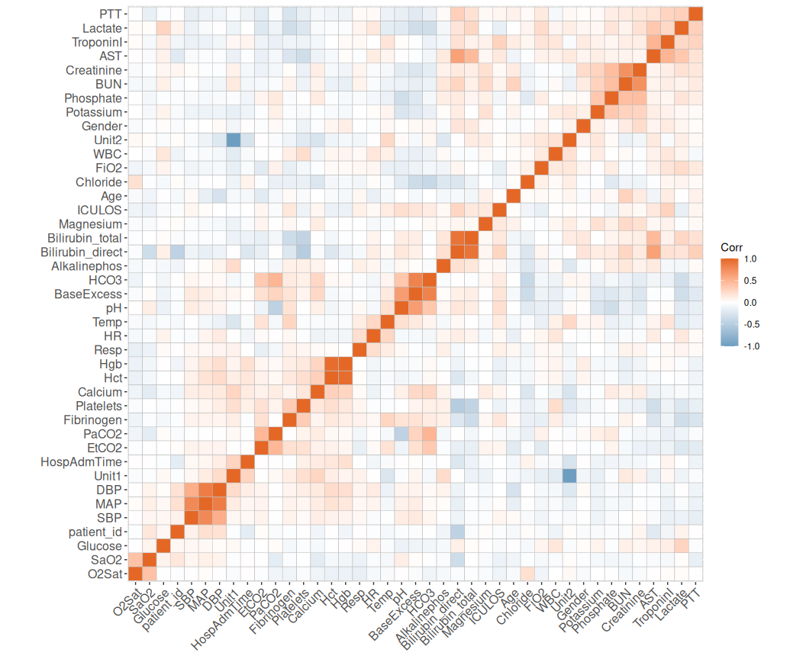
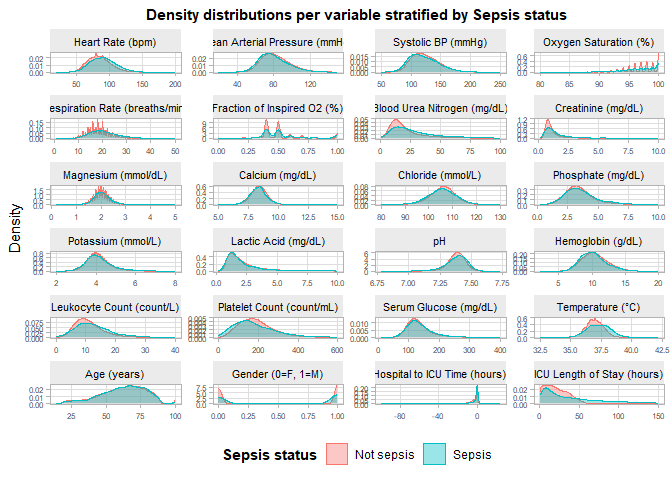
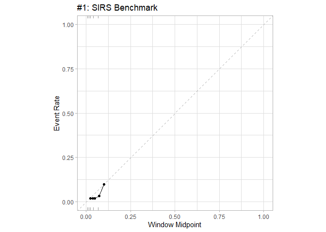
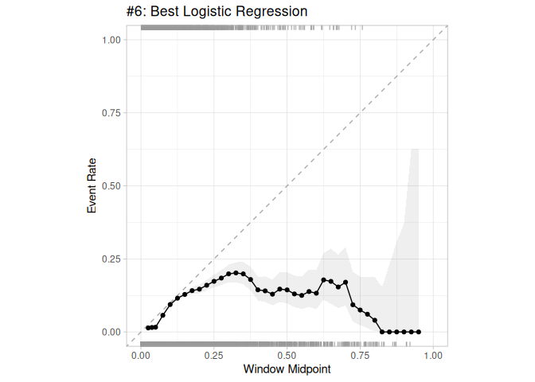
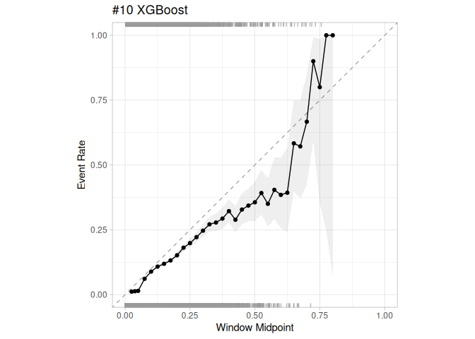

Sepsis Risk Prediction - Thesis Analysis Notebook
================
Thesis Project
2026-06-02

- [1. Libraries](#1-libraries)
- [2. Load Data](#2-load-data)
- [3. Exploratory: Correlation &
  Missingness](#3-exploratory-correlation--missingness)
  - [3.1 Missing Data Summary](#31-missing-data-summary)
  - [3.2 Pairwise Correlation](#32-pairwise-correlation)
  - [3.3 % of patients with at least one
    measurement](#33--of-patients-with-at-least-one-measurement)
  - [3.4 Density plots](#34-density-plots)
- [4. Shared Preprocessing steps (Logreg &
  XGBoost)](#4-shared-preprocessing-steps-logreg--xgboost)
  - [4.1 Apply Preprocessing (Shared Train &
    Test)](#41-apply-preprocessing-shared-train--test)
- [5. Benchmark - SIRS Logistic
  Regression](#5-benchmark---sirs-logistic-regression)
  - [5.1 SIRS-Specific Preprocessing](#51-sirs-specific-preprocessing)
  - [5.2 SIRS Recipe & Model](#52-sirs-recipe--model)
  - [5.3 Prep, Bake & Fit](#53-prep-bake--fit)
  - [5.4 Predictions & Evaluation](#54-predictions--evaluation)
- [6. Logistic Regression](#6-logistic-regression)
  - [6.1 Recipe & Model](#61-recipe--model)
  - [6.2 Prep, Bake & Fit](#62-prep-bake--fit)
  - [6.3 Predictions & Evaluation](#63-predictions--evaluation)
- [7. XGBoost](#7-xgboost)
  - [7.1 Recipe & Model](#71-recipe--model)
  - [7.2 Workflow & Fit](#72-workflow--fit)
  - [7.3 Predictions & Evaluation](#73-predictions--evaluation)
- [8. Model Comparison Summary](#8-model-comparison-summary)
- [9. Calibration plots](#9-calibration-plots)
- [10. Decision Curve Analysis (DCA)](#10-decision-curve-analysis-dca)
- [11. Feature Importance - SHAP
  values](#11-feature-importance---shap-values)
- [11. Timing of detection ICULOS
  Bins](#11-timing-of-detection-iculos-bins)

**Generative AI has been used throughout the code for the project**

------------------------------------------------------------------------

> **Research question:** How well does a machine-learning and classical
> statistical models trained on sepsis related data, predict the risk of
> sepsis compared to a SIRS-based benchmark when evaluated in terms of
> prediction accuracy, timing of detection, false alarm rates, and
> clinical application using the PhysioNet Sepsis Challenge dataset?

------------------------------------------------------------------------

# 1. Libraries

> - `tidyverse` / `tidymodels` - data preprocessing and modelling
> - `slider` - rolling window calculations for feature engineering
> - `ggcorrplot` - correlation heatmap
> - `riskRegression` - model comparison with confidence intervals and
>   contrasts
> - `probably` - calibration plots
> - `dcurves` - decision curve analysis
> - `shapviz` - SHAP feature importance for XGBoost

``` r
library(tidyverse)       
library(tidymodels)      
library(slider)          
library(ggcorrplot)      
library(riskRegression)  
library(dcurves)         
library(shapviz)
library(probably)
```

------------------------------------------------------------------------

# 2. Load Data

> - `sepsis_data` - full dataset, used only for correlations, data
>   missingness and density plots in Section 3
> - `train` / `test` - Sets used for all modelling

------------------------------------------------------------------------

# 3. Exploratory: Correlation & Missingness

> - Explores the full dataset before any modelling
> - Used to decide which variables to include and which to exclude

## 3.1 Missing Data Summary

> - Percentage of missing row-level-values per variable, sorted
>   descending

``` r
#In the sepsis_data set calculare the missing % for all variables
#change from wide to long format
#Sort by descendfing order

missing_summary <- sepsis_data %>%
  summarize(across(everything(), ~ mean(is.na(.x)) * 100)) %>%
  pivot_longer(everything(), names_to = "variable", values_to = "pct_missing") %>%
  arrange(desc(pct_missing))

missing_summary
```

    ## # A tibble: 43 × 2
    ##    variable         pct_missing
    ##    <chr>                  <dbl>
    ##  1 Bilirubin_direct        99.8
    ##  2 Fibrinogen              99.3
    ##  3 TroponinI               99.0
    ##  4 Bilirubin_total         98.5
    ##  5 Alkalinephos            98.4
    ##  6 AST                     98.4
    ##  7 Lactate                 97.3
    ##  8 PTT                     97.1
    ##  9 SaO2                    96.5
    ## 10 EtCO2                   96.3
    ## # ℹ 33 more rows

## 3.2 Pairwise Correlation

> - Spearman correlation matrix on all numeric predictors
> - Variables with \|r\| \> 0.8 will be removed downstream by
>   `step_corr` as one of our exclusion criteria

``` r
#select all numeric variables except sepsislabel
#calc pairwise correlation with speaman correlation

cor_matrix <- sepsis_data %>%
  select(where(is.numeric), -SepsisLabel) %>%
  cor(use = "pairwise.complete.obs", method = "spearman")
```

``` r
ggcorrplot(cor_matrix,
           hc.order = TRUE, type = "full",
           outline.color = "grey",
           ggtheme = ggplot2::theme_gray,
           colors = c("#6D9EC1", "white", "#E46726")
)
```

<!-- -->

## 3.3 % of patients with at least one measurement

``` r
#made with Claude
# % of patients with at least one measurement of each variable
patient_coverage <- function(df, id_col = "patient_id") {
  df %>%
    group_by(.data[[id_col]]) %>%
    summarise(across(everything(), ~ any(!is.na(.x))), .groups = "drop") %>%
    summarise(across(-all_of(id_col), ~ mean(.x) * 100)) %>%  
    pivot_longer(everything(), names_to = "variable", values_to = "pct_coverage") %>%
    arrange(desc(pct_coverage))
}

patient_coverage(sepsis_data, id_col = "patient_id")
```

    ## # A tibble: 42 × 2
    ##    variable    pct_coverage
    ##    <chr>              <dbl>
    ##  1 Age                100  
    ##  2 Gender             100  
    ##  3 ICULOS             100  
    ##  4 SepsisLabel        100  
    ##  5 source             100  
    ##  6 HospAdmTime        100.0
    ##  7 HR                 100.0
    ##  8 O2Sat              100.0
    ##  9 Resp                99.8
    ## 10 MAP                 99.7
    ## # ℹ 32 more rows

## 3.4 Density plots

- Based on our exclusion criteria, we’ve included 24 variables
- To explore the distribution of values stratified by SepsisLabel we
  will make density plots

``` r
# Made partially with Claude Code
# The 24 variables we've included
plot_vars <- c(
  "HR", "MAP", "SBP", "O2Sat",
  "Resp", "FiO2", "BUN", "Creatinine",
  "Magnesium", "Calcium", "Chloride", "Phosphate",
  "Potassium", "Lactate", "pH", "Hgb",
  "WBC", "Platelets", "Glucose", "Temp",
  "Age", "Gender", "HospAdmTime", "ICULOS"
)

# ----------labels for each of the included variabels-----------------------
var_labels <- c(
  HR          = "Heart Rate (bpm)",
  MAP         = "Mean Arterial Pressure (mmHg)",
  SBP         = "Systolic BP (mmHg)",
  O2Sat       = "Oxygen Saturation (%)",
  Resp        = "Respiration Rate (breaths/min)",
  FiO2        = "Fraction of Inspired O2 (%)",
  BUN         = "Blood Urea Nitrogen (mg/dL)",
  Creatinine  = "Creatinine (mg/dL)",
  Magnesium   = "Magnesium (mmol/dL)",
  Calcium     = "Calcium (mg/dL)",
  Chloride    = "Chloride (mmol/L)",
  Phosphate   = "Phosphate (mg/dL)",
  Potassium   = "Potassium (mmol/L)",
  Lactate     = "Lactic Acid (mg/dL)",
  pH          = "pH",
  Hgb         = "Hemoglobin (g/dL)",
  WBC         = "Leukocyte Count (count/L)",
  Platelets   = "Platelet Count (count/mL)",
  Glucose     = "Serum Glucose (mg/dL)",
  Temp        = "Temperature (°C)",
  Age         = "Age (years)",
  Gender      = "Gender (0=F, 1=M)",
  HospAdmTime = "Hospital to ICU Time (hours)",
  ICULOS      = "ICU Length of Stay (hours)"
)

# ---------------X-axis limits------------------------------------
xlims <- tribble(
  ~variable,    ~xmin,  ~xmax,
  "HR",          0,      200,
  "MAP",         0,      150,
  "SBP",         50,     250,
  "O2Sat",       80,     100,
  "Resp",        0,      50,
  "FiO2",        0,      1,
  "BUN",         0,      100,
  "Creatinine",  0,      10,
  "Magnesium",   0,      5,
  "Calcium",     5,      15,
  "Chloride",    80,     130,
  "Phosphate",   0,      10,
  "Potassium",   2,      8,
  "Lactate",     0,      10,
  "pH",          6.75,   7.75,
  "Hgb",         0,      20,
  "WBC",         0,      40,
  "Platelets",   0,      600,
  "Glucose",     0,      400,
  "Temp",        32.5,   42.5,
  "Age",         0,      100,
  "Gender",     -0.5,    1.5,
  "HospAdmTime",-100,    50,
  "ICULOS",      0,      150
)

# ── 3. Pivot to long and clip values to x limits ──────────────────────────────
sepsis_long <- sepsis_data %>%
  select(all_of(c(plot_vars, "SepsisLabel"))) %>%
  pivot_longer(
    cols      = all_of(plot_vars),
    names_to  = "variable",
    values_to = "value"
  ) %>%
  left_join(xlims, by = "variable") %>%
  filter(value >= xmin, value <= xmax) %>%   # <-- clips instead of scale tricks
  select(-xmin, -xmax) %>%
  mutate(variable = factor(variable, levels = plot_vars))

# ── 4. Plot ───────────────────────────────────────────────────────────────────
sepsis_long %>%
  ggplot(aes(
    x      = value,
    colour = factor(SepsisLabel),
    fill   = factor(SepsisLabel)
  )) +
  geom_density(alpha = 0.4) +
  facet_wrap(
    ~ variable,
    ncol     = 4,
    scales   = "free",
    labeller = as_labeller(var_labels)
  ) +
  scale_colour_manual(
    values = c("0" = "#F8766D", "1" = "#00BFC4"),
    labels = c("Not sepsis", "Sepsis")
  ) +
  scale_fill_manual(
    values = c("0" = "#F8766D", "1" = "#00BFC4"),
    labels = c("Not sepsis", "Sepsis")
  ) +
  labs(
    title  = "Density distributions per variable stratified by Sepsis status",
    x      = NULL,
    y      = "Density",
    colour = "Sepsis status",
    fill   = "Sepsis status"
  ) +
  theme_light() +
  theme(
    legend.position  = "bottom",
    legend.title     = element_text(face = "bold"),
    strip.text       = element_text(size = 8, colour = "black"),
    strip.background = element_rect(fill = "grey92", colour = NA),
    axis.text        = element_text(size = 6),
    panel.grid.minor = element_blank(),
    plot.title       = element_text(size=11, face="bold", hjust=0.5)
  )
```

<!-- -->

------------------------------------------------------------------------

# 4. Shared Preprocessing steps (Logreg & XGBoost)

> - Excluded variables - sparse or clinically redundant features removed
> - Missingness indicators - binary indicators showing which values were
>   missing before imputation
> - Rolling observation counts - measurement availability over 6h and
>   12h windows
> - Forward-fill - carries last known value forward within each
>   patient’s time series
> - Rolling means and SDs - captures short-term physiological trends
>   over 6h and 12h

``` r
# Variables excluded from the models
excluded_variables <- c(
  "DBP", "TroponinI", "EtCO2", "PaCO2", "SaO2", "BaseExcess",
  "HCO3", "Hct", "AST", "Alkalinephos", "Bilirubin_direct", "Bilirubin_total",
  "PTT", "Fibrinogen", "Unit1", "Unit2"
)

# Forward-fill within each patient's time series
ffill_dataset <- function(df) {
  df %>%
    arrange(patient_id, ICULOS) %>%
    group_by(patient_id) %>%
    fill(-patient_id, -ICULOS, .direction = "down") %>%
    ungroup()
}

# Binary missingness indicators (1 = was NA before forward-fill)
# No_indicator_variables are variables that are not to be included in as indicator vari
add_indicator_columns <- function(df, outcome = "SepsisLabel") {
  No_indicator_variables <- c("patient_id", "ICULOS", outcome)
  df %>%
    mutate(across(
      -any_of(No_indicator_variables),
      ~ as.integer(is.na(.x)),
      .names = "was_na_{.col}"
    ))
}

# Rolling observation counts (6h / 12h windows)
# Counts how many observations there were in a 6 or 12 h window
# Based on code provided by our Co-supervisor
add_obs_count_features <- function(df) {
  df %>%
    arrange(patient_id, ICULOS) %>%
    group_by(patient_id) %>%
    mutate(
      HR_obs_6h          = slide_int(HR,         ~sum(!is.na(.x)), .before = 5,  .complete = FALSE),
      Temp_obs_6h        = slide_int(Temp,       ~sum(!is.na(.x)), .before = 5,  .complete = FALSE),
      Resp_obs_6h        = slide_int(Resp,       ~sum(!is.na(.x)), .before = 5,  .complete = FALSE),
      MAP_obs_6h         = slide_int(MAP,        ~sum(!is.na(.x)), .before = 5,  .complete = FALSE),
      SBP_obs_6h         = slide_int(SBP,        ~sum(!is.na(.x)), .before = 5,  .complete = FALSE),
      WBC_obs_6h         = slide_int(WBC,        ~sum(!is.na(.x)), .before = 5,  .complete = FALSE),
      FiO2_obs_6h        = slide_int(FiO2,       ~sum(!is.na(.x)), .before = 5,  .complete = FALSE),
      Lactate_obs_6h     = slide_int(Lactate,    ~sum(!is.na(.x)), .before = 5,  .complete = FALSE),
      Platelets_obs_6h   = slide_int(Platelets,  ~sum(!is.na(.x)), .before = 5,  .complete = FALSE),
      Creatinine_obs_6h  = slide_int(Creatinine, ~sum(!is.na(.x)), .before = 5,  .complete = FALSE),
      HR_obs_12h         = slide_int(HR,         ~sum(!is.na(.x)), .before = 11, .complete = FALSE),
      Temp_obs_12h       = slide_int(Temp,       ~sum(!is.na(.x)), .before = 11, .complete = FALSE),
      Resp_obs_12h       = slide_int(Resp,       ~sum(!is.na(.x)), .before = 11, .complete = FALSE),
      MAP_obs_12h        = slide_int(MAP,        ~sum(!is.na(.x)), .before = 11, .complete = FALSE),
      SBP_obs_12h        = slide_int(SBP,        ~sum(!is.na(.x)), .before = 11, .complete = FALSE),
      WBC_obs_12h        = slide_int(WBC,        ~sum(!is.na(.x)), .before = 11, .complete = FALSE),
      FiO2_obs_12h       = slide_int(FiO2,       ~sum(!is.na(.x)), .before = 11, .complete = FALSE),
      Lactate_obs_12h    = slide_int(Lactate,    ~sum(!is.na(.x)), .before = 11, .complete = FALSE),
      Platelets_obs_12h  = slide_int(Platelets,  ~sum(!is.na(.x)), .before = 11,  .complete = FALSE),
      Creatinine_obs_12h = slide_int(Creatinine, ~sum(!is.na(.x)), .before = 11,  .complete = FALSE),
      total_obs_6h       = HR_obs_6h + Temp_obs_6h + Resp_obs_6h + MAP_obs_6h +
                           SBP_obs_6h + WBC_obs_6h + FiO2_obs_6h + Lactate_obs_6h +
                           Platelets_obs_6h + Creatinine_obs_6h
    ) %>%
    ungroup()
}

# Rolling means (6h + 12h) and rolling SDs (6h)
# calcs the mean or SD over a 6 or 12 h window
add_rolling_features <- function(df) {
  df %>%
    arrange(patient_id, ICULOS) %>%
    group_by(patient_id) %>%
    mutate(
      # 6h rolling means
      HR_roll_mean_6         = slide_dbl(HR,         ~mean(.x, na.rm = TRUE), .before = 5,  .complete = FALSE),
      Temp_roll_mean_6       = slide_dbl(Temp,       ~mean(.x, na.rm = TRUE), .before = 5,  .complete = FALSE),
      Resp_roll_mean_6       = slide_dbl(Resp,       ~mean(.x, na.rm = TRUE), .before = 5,  .complete = FALSE),
      MAP_roll_mean_6        = slide_dbl(MAP,        ~mean(.x, na.rm = TRUE), .before = 5,  .complete = FALSE),
      SBP_roll_mean_6        = slide_dbl(SBP,        ~mean(.x, na.rm = TRUE), .before = 5,  .complete = FALSE),
      WBC_roll_mean_6        = slide_dbl(WBC,        ~mean(.x, na.rm = TRUE), .before = 5,  .complete = FALSE),
      FiO2_roll_mean_6       = slide_dbl(FiO2,       ~mean(.x, na.rm = TRUE), .before = 5,  .complete = FALSE),
      Lactate_roll_mean_6    = slide_dbl(Lactate,    ~mean(.x, na.rm = TRUE), .before = 5,  .complete = FALSE),
      Platelets_roll_mean_6  = slide_dbl(Platelets,  ~mean(.x, na.rm = TRUE), .before = 5,  .complete = FALSE),
      Creatinine_roll_mean_6 = slide_dbl(Creatinine, ~mean(.x, na.rm = TRUE), .before = 5,  .complete = FALSE),
      # 12h rolling means
      HR_roll_mean_12        = slide_dbl(HR,         ~mean(.x, na.rm = TRUE), .before = 11, .complete = FALSE),
      Temp_roll_mean_12      = slide_dbl(Temp,       ~mean(.x, na.rm = TRUE), .before = 11, .complete = FALSE),
      Resp_roll_mean_12      = slide_dbl(Resp,       ~mean(.x, na.rm = TRUE), .before = 11, .complete = FALSE),
      MAP_roll_mean_12       = slide_dbl(MAP,        ~mean(.x, na.rm = TRUE), .before = 11, .complete = FALSE),
      SBP_roll_mean_12       = slide_dbl(SBP,        ~mean(.x, na.rm = TRUE), .before = 11, .complete = FALSE),
      WBC_roll_mean_12       = slide_dbl(WBC,        ~mean(.x, na.rm = TRUE), .before = 11, .complete = FALSE),
      FiO2_roll_mean_12      = slide_dbl(FiO2,       ~mean(.x, na.rm = TRUE), .before = 11, .complete = FALSE),
      Lactate_roll_mean_12   = slide_dbl(Lactate,    ~mean(.x, na.rm = TRUE), .before = 11, .complete = FALSE),
      Platelets_roll_mean_12 = slide_dbl(Platelets,  ~mean(.x, na.rm = TRUE), .before = 11,  .complete = FALSE),
      Creatinine_roll_mean_12= slide_dbl(Creatinine, ~mean(.x, na.rm = TRUE), .before = 11,  .complete = FALSE),
      # 6h rolling SDs
      HR_roll_sd_6           = slide_dbl(HR,         ~sd(.x, na.rm = TRUE), .before = 5, .complete = FALSE),
      Temp_roll_sd_6         = slide_dbl(Temp,       ~sd(.x, na.rm = TRUE), .before = 5, .complete = FALSE),
      Resp_roll_sd_6         = slide_dbl(Resp,       ~sd(.x, na.rm = TRUE), .before = 5, .complete = FALSE),
      MAP_roll_sd_6          = slide_dbl(MAP,        ~sd(.x, na.rm = TRUE), .before = 5, .complete = FALSE),
      SBP_roll_sd_6          = slide_dbl(SBP,        ~sd(.x, na.rm = TRUE), .before = 5, .complete = FALSE),
      WBC_roll_sd_6          = slide_dbl(WBC,        ~sd(.x, na.rm = TRUE), .before = 5, .complete = FALSE),
      FiO2_roll_sd_6         = slide_dbl(FiO2,       ~sd(.x, na.rm = TRUE), .before = 5, .complete = FALSE),
      Lactate_roll_sd_6      = slide_dbl(Lactate,    ~sd(.x, na.rm = TRUE), .before = 5, .complete = FALSE),
      Platelets_roll_sd_6    = slide_dbl(Platelets,  ~sd(.x, na.rm = TRUE), .before = 5, .complete = FALSE),
      Creatinine_roll_sd_6   = slide_dbl(Creatinine, ~sd(.x, na.rm = TRUE), .before = 5, .complete = FALSE)
    ) %>%
    ungroup()
}
```

## 4.1 Apply Preprocessing (Shared Train & Test)

``` r
#removes all excluded variables from the training set
#adds indicator variables
#adds observation counters
#forward fills
#adds rolling features
#Makes sepsislabel and gender a factor
train_preprocess_ffill <- train %>%
  select(-any_of(excluded_variables)) %>%
  add_indicator_columns(outcome = "SepsisLabel") %>%
  add_obs_count_features() %>%
  ffill_dataset() %>%
  add_rolling_features() %>%
  mutate(
    SepsisLabel = as.factor(SepsisLabel),
    Gender      = as.factor(Gender)
  )


#same for test set
test_preprocess_ffill <- test %>%
  select(-any_of(excluded_variables)) %>%
  add_indicator_columns(outcome = "SepsisLabel") %>%
  add_obs_count_features() %>%
  ffill_dataset() %>%
  add_rolling_features() %>%
  mutate(
    SepsisLabel = as.factor(SepsisLabel),
    Gender      = as.factor(Gender)
  )

cat("Preprocessed train rows:", nrow(train_preprocess_ffill), "\n")
```

    ## Preprocessed train rows: 1242524

``` r
cat("Preprocessed train columns:", ncol(train_preprocess_ffill), "\n")
```

    ## Preprocessed train columns: 100

``` r
cat("Preprocessed test rows:", nrow(test_preprocess_ffill), "\n")
```

    ## Preprocessed test rows: 309686

------------------------------------------------------------------------

# 5. Benchmark - SIRS Logistic Regression

> - SIRS criteria: HR \> 90, Temp outside 36-38°C, RR \> 20, WBC outside
>   4-12
> - Each met criteria adds 1, giving a score of 0-4
> - Score used as the sole predictor in a logistic regression

## 5.1 SIRS-Specific Preprocessing

``` r
train_sirs <- train %>%
  select(-any_of(excluded_variables)) %>%
  ffill_dataset() %>%
  mutate(SepsisLabel = as.factor(SepsisLabel))

test_sirs <- test %>%
  select(-any_of(excluded_variables)) %>%
  ffill_dataset() %>%
  mutate(SepsisLabel = as.factor(SepsisLabel))
```

## 5.2 SIRS Recipe & Model

``` r
# Creates recipe for the SIRS logistc reg model based on the 4 variables 
# uses step impute mean to calc the global mean of each variable in training set, to be   # used in the test set as well
# Creates the SIRS score feature and selects only SepsisLabel and SIRS_score as variables
# Sets model to logistic regression with engine as glm and classification as it is a      # binary outcome variable

SIRS_recipe <- recipe(SepsisLabel ~ HR + Temp + Resp + WBC, data = train_sirs) %>%
  step_impute_mean(all_numeric_predictors()) %>%
  step_mutate(
    SIRS_score = (HR > 90) + (Temp > 38 | Temp < 36) + (Resp > 20) + (WBC > 12 | WBC < 4)
  ) %>%
  step_select(SepsisLabel, SIRS_score)


logistic_sirs_model <- logistic_reg() %>%
  set_engine("glm") %>%
  set_mode("classification")
```

## 5.3 Prep, Bake & Fit

``` r
#preps and bakes training and test set
#fits the baked training set

Sirs_benchmark_prep          <- SIRS_recipe %>% prep(training = train_sirs)
Sirs_benchmark_training_bake <- Sirs_benchmark_prep %>% bake(new_data = NULL)
Sirs_benchmark_test_bake     <- Sirs_benchmark_prep %>% bake(new_data = test_sirs)

Logistic_sirs_fit <- logistic_sirs_model %>%
  fit(SepsisLabel ~ SIRS_score, data = Sirs_benchmark_training_bake)

Logistic_sirs_fit
```

    ## parsnip model object
    ## 
    ## 
    ## Call:  stats::glm(formula = SepsisLabel ~ SIRS_score, family = stats::binomial, 
    ##     data = data)
    ## 
    ## Coefficients:
    ## (Intercept)   SIRS_score  
    ##     -4.6567       0.5087  
    ## 
    ## Degrees of Freedom: 1242523 Total (i.e. Null);  1242522 Residual
    ## Null Deviance:       223200 
    ## Residual Deviance: 217100    AIC: 217100

## 5.4 Predictions & Evaluation

``` r
#predicts based on baked test set
#calcs the AUC and brier

prob_preds_sirs <- predict(Logistic_sirs_fit, new_data = Sirs_benchmark_test_bake, type = "prob")

sirs_results <- Sirs_benchmark_test_bake %>%
  select(SepsisLabel) %>%
  bind_cols(prob_preds_sirs) %>%
  mutate(SepsisLabel = factor(SepsisLabel, levels = c("1", "0")))

sirs_metrics <- metric_set(roc_auc, brier_class)(
  sirs_results, truth = SepsisLabel, .pred_1, event_level = "first"
)

sirs_metrics
```

    ## # A tibble: 2 × 3
    ##   .metric     .estimator .estimate
    ##   <chr>       <chr>          <dbl>
    ## 1 roc_auc     binary        0.643 
    ## 2 brier_class binary        0.0178

------------------------------------------------------------------------

# 6. Logistic Regression

> - Uses the full feature set including rolling features and missingness
>   indicators
> - SIRS score added as a predictor
> - Correlated features removed at 0.8 threshold

## 6.1 Recipe & Model

``` r
sepsis_recipe_log <- recipe(SepsisLabel ~ ., data = train_preprocess_ffill) %>%
  step_rm(patient_id) %>%
  step_dummy(Gender) %>%
  step_impute_mean(all_numeric_predictors()) %>%
  step_mutate(
    SIRS_score = (HR > 90) + (Temp > 38 | Temp < 36) + (Resp > 20) + (WBC > 12 | WBC < 4)
  ) %>%
  step_corr(threshold = 0.8)

logistic_sepsis_model <- logistic_reg() %>%
  set_engine("glm") %>%
  set_mode("classification")
```

## 6.2 Prep, Bake & Fit

``` r
Sepsis_log_prep          <- sepsis_recipe_log %>% prep(training = train_preprocess_ffill)
Sepsis_log_training_bake <- Sepsis_log_prep %>% bake(new_data = NULL)
Sepsis_log_test_bake     <- Sepsis_log_prep %>% bake(new_data = test_preprocess_ffill)

Logistic_sepsis_fit <- logistic_sepsis_model %>%
  fit(SepsisLabel ~ ., data = Sepsis_log_training_bake)

Logistic_sepsis_fit
```

    ## parsnip model object
    ## 
    ## 
    ## Call:  stats::glm(formula = SepsisLabel ~ ., family = stats::binomial, 
    ##     data = data)
    ## 
    ## Coefficients:
    ##             (Intercept)                       HR                    O2Sat  
    ##              -1.689e+01                5.205e-03               -3.526e-03  
    ##                    Temp                      SBP                      MAP  
    ##               2.199e-01               -7.162e-04               -3.935e-03  
    ##                    Resp                     FiO2                       pH  
    ##              -1.539e-02                1.263e+00                3.489e-01  
    ##                     BUN                  Calcium                 Chloride  
    ##               5.671e-03               -4.188e-02               -4.713e-03  
    ##              Creatinine                  Glucose                  Lactate  
    ##               2.920e-01                6.892e-04                9.780e-02  
    ##               Magnesium                Phosphate                Potassium  
    ##               1.267e-01               -4.301e-02               -1.358e-01  
    ##                     Hgb                      WBC                Platelets  
    ##              -4.016e-02                5.481e-02               -2.997e-03  
    ##                     Age              HospAdmTime                   ICULOS  
    ##              -4.519e-04               -3.957e-04                1.201e-02  
    ##               was_na_HR             was_na_O2Sat              was_na_Temp  
    ##               6.742e-02               -5.657e-02                7.239e-03  
    ##              was_na_SBP               was_na_MAP              was_na_Resp  
    ##               8.786e-02               -8.759e-02                5.765e-02  
    ##             was_na_FiO2                was_na_pH               was_na_BUN  
    ##              -1.705e-02               -1.493e-01               -1.993e-01  
    ##          was_na_Calcium          was_na_Chloride        was_na_Creatinine  
    ##              -5.942e-02                2.242e-01                2.089e-01  
    ##          was_na_Glucose           was_na_Lactate         was_na_Magnesium  
    ##               1.827e-01               -1.022e-01                4.971e-02  
    ##        was_na_Phosphate         was_na_Potassium               was_na_Hgb  
    ##              -2.585e-01               -9.003e-02               -1.880e-01  
    ##              was_na_WBC         was_na_Platelets               was_na_Age  
    ##               1.655e-01               -5.079e-02                       NA  
    ##           was_na_Gender       was_na_HospAdmTime                HR_obs_6h  
    ##                      NA               -8.628e+00                5.980e-02  
    ##             Temp_obs_6h              Resp_obs_6h               MAP_obs_6h  
    ##              -8.703e-02                2.125e-02                3.757e-02  
    ##              SBP_obs_6h               WBC_obs_6h              FiO2_obs_6h  
    ##              -4.027e-02               -1.159e-01                1.659e-01  
    ##          Lactate_obs_6h         Platelets_obs_6h        Creatinine_obs_6h  
    ##               2.079e-01                1.598e-01                1.214e-01  
    ##              HR_obs_12h             Temp_obs_12h             Resp_obs_12h  
    ##              -8.146e-02               -2.733e-02               -6.244e-02  
    ##             MAP_obs_12h              SBP_obs_12h              WBC_obs_12h  
    ##               1.210e-01               -5.955e-02                4.850e-03  
    ##            FiO2_obs_12h          Lactate_obs_12h        Platelets_obs_12h  
    ##               4.766e-02                3.214e-02               -8.593e-02  
    ##      Creatinine_obs_12h             total_obs_6h           HR_roll_mean_6  
    ##               1.809e-03                       NA               -4.611e-04  
    ##        Temp_roll_mean_6         Resp_roll_mean_6          MAP_roll_mean_6  
    ##               3.705e-01               -2.454e-03               -8.204e-04  
    ##         SBP_roll_mean_6          WBC_roll_mean_6         FiO2_roll_mean_6  
    ##              -1.690e-03               -8.484e-03               -2.325e-01  
    ##     Lactate_roll_mean_6    Platelets_roll_mean_6   Creatinine_roll_mean_6  
    ##               1.408e-01                6.443e-03                1.315e-02  
    ##         HR_roll_mean_12        Temp_roll_mean_12        Resp_roll_mean_12  
    ##               4.982e-04               -2.719e-01                3.785e-02  
    ##        MAP_roll_mean_12         SBP_roll_mean_12         WBC_roll_mean_12  
    ##              -8.241e-03                4.281e-03               -4.179e-02  
    ##       FiO2_roll_mean_12     Lactate_roll_mean_12   Platelets_roll_mean_12  
    ##              -1.030e+00               -3.053e-01               -4.387e-03  
    ## Creatinine_roll_mean_12             HR_roll_sd_6           Temp_roll_sd_6  
    ##              -2.552e-01                1.394e-02                3.651e-01  
    ##          Resp_roll_sd_6            MAP_roll_sd_6            SBP_roll_sd_6  
    ##              -2.257e-02                7.123e-03                1.928e-02  
    ##           WBC_roll_sd_6           FiO2_roll_sd_6        Lactate_roll_sd_6  
    ##               4.084e-02                2.127e-02               -2.461e-01  
    ##     Platelets_roll_sd_6     Creatinine_roll_sd_6                Gender_X1  
    ##               6.429e-04                2.686e-01                6.938e-02  
    ##              SIRS_score  
    ##               2.550e-01  
    ## 
    ## Degrees of Freedom: 1242523 Total (i.e. Null);  1242427 Residual
    ## Null Deviance:       223200 
    ## Residual Deviance: 196300    AIC: 196500

## 6.3 Predictions & Evaluation

``` r
prob_preds_sepsis <- predict(Logistic_sepsis_fit, new_data = Sepsis_log_test_bake, type = "prob")

sepsis_log_results <- Sepsis_log_test_bake %>%
  select(SepsisLabel) %>%
  bind_cols(prob_preds_sepsis) %>%
  mutate(SepsisLabel = factor(SepsisLabel, levels = c("1", "0")))

log_reg_metrics <- metric_set(roc_auc, brier_class)(
  sepsis_log_results, truth = SepsisLabel, .pred_1, event_level = "first"
)

log_reg_metrics
```

    ## # A tibble: 2 × 3
    ##   .metric     .estimator .estimate
    ##   <chr>       <chr>          <dbl>
    ## 1 roc_auc     binary        0.782 
    ## 2 brier_class binary        0.0177

------------------------------------------------------------------------

# 7. XGBoost

> - Uses the same feature set as the logistic regression
> - Hyperparameters from prior tuning: 500 trees, depth 5, learning rate
>   0.026, early stopping at 20 rounds
> - 10% internal validation split used for early stopping

## 7.1 Recipe & Model

``` r
#recipe for the XGBoost model
#The hyperparameters for the xgboost model is found through tuning- not included in this code
#tree depth and learn_rate were the only two variables that were tuned with 500 trees

sepsis_recipe_xgb <- recipe(SepsisLabel ~ ., data = train_preprocess_ffill) %>%
  step_rm(patient_id) %>%
  step_dummy(Gender) %>%
  step_impute_mean(all_numeric_predictors()) %>%
  step_mutate(
    SIRS_score = (HR > 90) + (Temp > 38 | Temp < 36) + (Resp > 20) + (WBC > 12 | WBC < 4)
  ) %>%
  step_corr(threshold = 0.8)

xgb_sepsis_model <- boost_tree(
  trees      = 500,
  tree_depth = 5,
  learn_rate = 0.02635494,
  stop_iter  = 20
) %>%
  set_engine("xgboost", counts = FALSE, eval_metric = "auc", validation = 0.1) %>%
  set_mode("classification")
```

## 7.2 Workflow & Fit

``` r
xgb_prep <- sepsis_recipe_xgb %>% prep(training = train_preprocess_ffill)
train_baked_xgb  <- xgb_prep %>% bake(new_data = NULL)
test_baked_xgb   <- xgb_prep %>% bake(new_data = test_preprocess_ffill)

xgb_wf <- workflow() %>%
  add_formula(SepsisLabel ~ .) %>%
  add_model(xgb_sepsis_model)

set.seed(123)
xgb_final_fit <- xgb_wf %>% fit(data = train_baked_xgb)

xgb_final_fit
```

    ## ══ Workflow [trained] ══════════════════════════════════════════════════════════
    ## Preprocessor: Formula
    ## Model: boost_tree()
    ## 
    ## ── Preprocessor ────────────────────────────────────────────────────────────────
    ## SepsisLabel ~ .
    ## 
    ## ── Model ───────────────────────────────────────────────────────────────────────
    ## ##### xgb.Booster
    ## call:
    ##   xgboost::xgb.train(params = list(eta = 0.02635494, max_depth = 5, 
    ##     gamma = 0, colsample_bytree = 1, colsample_bynode = 1, min_child_weight = 1, 
    ##     subsample = 1, nthread = 1, eval_metric = "auc", objective = "binary:logistic"), 
    ##     data = x$data, nrounds = 500, evals = x$watchlist, verbose = 0, 
    ##     early_stopping_rounds = 20)
    ## # of features: 99 
    ## # of rounds:  500 
    ## xgb.attributes:
    ##    best_iteration, best_score 
    ## callbacks:
    ##    early_stop, evaluation_log 
    ## evaluation_log:
    ##   iter validation_auc
    ##  <num>          <num>
    ##      1      0.7779041
    ##      2      0.7830109
    ##    ---            ---
    ##    499      0.8849447
    ##    500      0.8849979

## 7.3 Predictions & Evaluation

``` r
prob_preds_xgb <- predict(xgb_final_fit, new_data = test_baked_xgb, type = "prob")

xgb_results <- test_baked_xgb %>%
  select(SepsisLabel) %>%
  bind_cols(prob_preds_xgb) %>%
  mutate(SepsisLabel = factor(SepsisLabel, levels = c("1", "0")))

xgb_metrics <- metric_set(roc_auc, brier_class)(
  xgb_results, truth = SepsisLabel, .pred_1, event_level = "first"
)

xgb_metrics
```

    ## # A tibble: 2 × 3
    ##   .metric     .estimator .estimate
    ##   <chr>       <chr>          <dbl>
    ## 1 roc_auc     binary        0.837 
    ## 2 brier_class binary        0.0170

------------------------------------------------------------------------

# 8. Model Comparison Summary

> - Compares all three models against the SIRS benchmark
> - AUC and Brier score reported with confidence intervals and pairwise
>   contrast tests

``` r
#eval on the original test set as it has the same number and arrangement of rows as the #baked

pred_list <- list(
  "SIRS Benchmark " = prob_preds_sirs$.pred_1,
  "Logistic Regression" = prob_preds_sepsis$.pred_1,
  "XGBoost (tuned)" = prob_preds_xgb$.pred_1)


score_evaluation <- test %>% 
  transmute(SepsisLabel = as.numeric(as.character(SepsisLabel)))

comparison <- Score(
  object = pred_list,
  formula = SepsisLabel ~ 1,
  data = score_evaluation,
  metrics = c("auc", "brier"),
  contrasts = TRUE,
  plots = "calibration"
)

summary(comparison)
```

    ## $score
    ## Key: <Model>
    ##                  Model          AUC (%)     Brier (%)
    ##                 <fctr>           <char>        <char>
    ## 1:          Null model             <NA> 1.8 [1.7;1.8]
    ## 2:     SIRS Benchmark  64.3 [63.6;65.0] 1.8 [1.7;1.8]
    ## 3: Logistic Regression 78.2 [77.6;78.8] 1.8 [1.7;1.8]
    ## 4:     XGBoost (tuned) 83.7 [83.2;84.2] 1.7 [1.7;1.7]
    ## 
    ## $contrasts
    ##                  Model           Reference    delta AUC (%) p-value
    ##                 <fctr>              <char>           <char>  <char>
    ## 1:     SIRS Benchmark           Null model                         
    ## 2: Logistic Regression          Null model                         
    ## 3: Logistic Regression     SIRS Benchmark  13.9 [13.2;14.6] < 0.001
    ## 4:     XGBoost (tuned)          Null model                         
    ## 5:     XGBoost (tuned)     SIRS Benchmark  19.4 [18.7;20.1] < 0.001
    ## 6:     XGBoost (tuned) Logistic Regression    5.5 [5.0;5.9] < 0.001
    ##     delta Brier (%) p-value
    ##              <char>  <char>
    ## 1: -0.0 [-0.0;-0.0] < 0.001
    ## 2: -0.0 [-0.0;-0.0] < 0.001
    ## 3: -0.0 [-0.0;-0.0] < 0.001
    ## 4: -0.1 [-0.1;-0.1] < 0.001
    ## 5: -0.1 [-0.1;-0.1] < 0.001
    ## 6: -0.1 [-0.1;-0.1] < 0.001

``` r
cat("\n=== AUC contrasts (vs #1 Benchmark) ===\n");   print(comparison$AUC$contrasts)
```

    ## 
    ## === AUC contrasts (vs #1 Benchmark) ===

    ##                  model           reference  delta.AUC          se      lower
    ##                 <char>              <char>      <num>       <num>      <num>
    ## 1: Logistic Regression     SIRS Benchmark  0.13889093 0.003625302 0.13178547
    ## 2:     XGBoost (tuned)     SIRS Benchmark  0.19380908 0.003705596 0.18654625
    ## 3:     XGBoost (tuned) Logistic Regression 0.05491815 0.002319208 0.05037259
    ##         upper             p
    ##         <num>         <num>
    ## 1: 0.14599640 3.932763e-321
    ## 2: 0.20107192  0.000000e+00
    ## 3: 0.05946371 5.836671e-124

``` r
cat("\n=== Brier contrasts (vs #1 Benchmark) ===\n"); print(comparison$Brier$contrasts)
```

    ## 
    ## === Brier contrasts (vs #1 Benchmark) ===

    ##                  model           reference   delta.Brier           se
    ##                 <fctr>              <fctr>         <num>        <num>
    ## 1:     SIRS Benchmark           Null model -0.0001314236 7.220196e-06
    ## 2: Logistic Regression          Null model -0.0002836593 4.028065e-05
    ## 3:     XGBoost (tuned)          Null model -0.0009050545 5.362384e-05
    ## 4: Logistic Regression     SIRS Benchmark  -0.0001522357 3.802489e-05
    ## 5:     XGBoost (tuned)     SIRS Benchmark  -0.0007736309 5.118414e-05
    ## 6:     XGBoost (tuned) Logistic Regression -0.0006213952 4.068477e-05
    ##            lower         upper            p
    ##            <num>         <num>        <num>
    ## 1: -0.0001455749 -1.172723e-04 4.955362e-74
    ## 2: -0.0003626079 -2.047107e-04 1.893994e-12
    ## 3: -0.0010101553 -7.999537e-04 6.549971e-64
    ## 4: -0.0002267631 -7.770828e-05 6.239102e-05
    ## 5: -0.0008739500 -6.733118e-04 1.296344e-51
    ## 6: -0.0007011359 -5.416545e-04 1.149971e-52

------------------------------------------------------------------------

# 9. Calibration plots

> - Checks whether predicted probabilities match observed sepsis rates
> - A well-calibrated model follows the diagonal
> - Deviation indicates over- or under-estimation of risk

``` r
#creates the calibration plots 

cal_plot_windowed(sirs_results, truth = SepsisLabel, .pred_1,
                  event_level = "first", step_size = 0.025) + ggtitle("#1: SIRS Benchmark")
```

<!-- -->

``` r
cal_plot_windowed(sepsis_log_results, truth = SepsisLabel, .pred_1,
                  event_level = "first", step_size = 0.025) + ggtitle("#6: Best Logistic Regression")
```

<!-- -->

``` r
cal_plot_windowed(xgb_results, truth = SepsisLabel, .pred_1,
                  event_level = "first", step_size = 0.025) + ggtitle("#10 XGBoost")
```

<!-- -->

------------------------------------------------------------------------

# 10. Decision Curve Analysis (DCA)

> - Evaluates clinical utility across a range of decision thresholds
> - A model is useful if its curve sits above both “treat all” and
>   “treat none”

``` r
# DCA Curve, madewith help from Claude
dca_df <- test %>%
  select(SepsisLabel) %>%
  mutate(
    SIRS_Benchmark = sirs_results$.pred_1,
    Best_LogReg    = sepsis_log_results$.pred_1,
    XGBoost        = xgb_results$.pred_1
  )

dca(SepsisLabel ~ SIRS_Benchmark + Best_LogReg + XGBoost, data = dca_df, thresholds = seq(0, 0.40, by = 0.005)) %>%
  plot(smooth = TRUE) +
  labs(
    title = "Decision Curve Analysis – Three-Model Comparison",
    x= "Threshold Probability",
    y = "Net Benefit (per 100 patients)"
  ) +
  scale_x_continuous(breaks = seq(0, 0.40, by = 0.05), limits = c(0, 0.40), labels = scales::percent_format(accuracy = 1)) +
  scale_y_continuous(labels = function(x) x * 100) +
  theme_bw() +
  theme(plot.title = element_text(face = "bold", size = 13))
```

    ## Assuming '1' is [Event] and '0' is [non-Event]

    ## Scale for x is already present.
    ## Adding another scale for x, which will replace the existing scale.

<!-- -->

------------------------------------------------------------------------

# 11. Feature Importance - SHAP values

> - Beeswarm plot
> - 16,000 test observations

``` r
# Baked test data using the recipe from the fitted workflow with 16000 samlpes
xgb_core <- extract_fit_engine(xgb_final_fit)

set.seed(42)
X_xgb <- test_baked_xgb %>%
  select(-SepsisLabel) %>%
  slice_sample(n = 16000) %>%
  as.matrix()

shap_xgb <- shapviz(xgb_core, X_pred = X_xgb)
shap_xgb$S <- -shap_xgb$S

feature_names <- c(
  ICULOS              = "ICU Length of Stay",
  FiO2_obs_6h         = "FiO2 Observations (6h)",
  HospAdmTime         = "Hospital Admission Time",
  Temp                = "Temperature",
  Creatinine          = "Creatinine",
  SIRS_score          = "SIRS Score",
  Temp_roll_mean_6    = "Temperature Rolling Mean (6h)",
  BUN                 = "Blood Urea Nitrogen",
  Resp_roll_mean_12   = "Respiratory Rate Rolling Mean (12h)",
  Lactate_obs_12h     = "Lactate Observations (12h)",
  Lactate_obs_6h      = "Lactate Observations (6h)",
  WBC                 = "White Blood Cell Count",
  Temp_obs_12h         = "Temperature Observations (12h)",
  HR                  = "Heart Rate",
  MAP_roll_mean_6     = "Mean Arterial Pressure Mean (6h)"
)

safe_names <- feature_names[colnames(shap_xgb$S)]
safe_names[is.na(safe_names)] <- colnames(shap_xgb$S)[is.na(safe_names)]
colnames(shap_xgb$S) <- safe_names
colnames(shap_xgb$X) <- safe_names

sv_importance(shap_xgb, kind = "beeswarm") +
  ggtitle("XGBoost - SHAP Feature Importance") +
  theme_bw(base_size = 10) +
  theme(
    plot.title = element_text(face = "bold", size = 10),
    axis.text.y = element_text(face = "bold")
  )
```

<!-- -->

------------------------------------------------------------------------

# 11. Timing of detection ICULOS Bins

``` r
#creates 4 groups of ICULOS based on the test dataset
test_df <- test %>%
  mutate(
    iculos_bin = cut(ICULOS, breaks = c(0, 6, 24, 72, Inf), labels = c("1-6h", "7-24h", "25-72h", ">72h"), right = TRUE),
    SepsisLabel = factor(SepsisLabel, levels = c("1", "0")),
    prob_preds_xgb = as.numeric(prob_preds_xgb$.pred_1),
    prob_preds_sepsis = as.numeric(prob_preds_sepsis$.pred_1),
    prob_preds_sirs = as.numeric(prob_preds_sirs$.pred_1)
  )

# calc AUC per group with roc auc vec as it is in summarise
auc_by_bin <- test_df %>%
  group_by(iculos_bin) %>%
  summarise(
    XGBoost = roc_auc_vec(SepsisLabel, prob_preds_xgb,    event_level = "first"),
    Logistic = roc_auc_vec(SepsisLabel, prob_preds_sepsis, event_level = "first"),
    SIRS = roc_auc_vec(SepsisLabel, prob_preds_sirs,   event_level = "first"),
    n_positive = sum(SepsisLabel == "1"),
    n_obs = n()
  )

auc_by_bin
```

    ## # A tibble: 4 × 6
    ##   iculos_bin XGBoost Logistic  SIRS n_positive  n_obs
    ##   <fct>        <dbl>    <dbl> <dbl>      <int>  <int>
    ## 1 1-6h         0.759    0.678 0.596        673  44713
    ## 2 7-24h        0.817    0.754 0.644       1791 133627
    ## 3 25-72h       0.836    0.778 0.651       1855 118707
    ## 4 >72h         0.664    0.607 0.592       1339  12639
